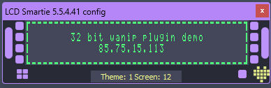

# Dracula for [LCD Smartie](https://lcdsmartie.sourceforge.net/)

> A dark theme for [LCD Smartie](https://lcdsmartie.sourceforge.net/).

## Install

All instructions can be found at [draculatheme.com/lcd-smartie](https://draculatheme.com/lcd-smartie).

## More on LCD Smartie

- [Forums](https://lcdsmartie.org) - Our forums for help and general discussions.
- [GitHub](https://github.com/stokie-ant/lcdsmartie-laz) - The active dev branch of the program [You can find the latest version here].
- [SourceForge](https://lcdsmartie.sourceforge.net/) - Old pages and old dev branch [Freezed].

## Team

This theme is maintained by the following person.

|  |
| --------------------------------------------------------------------------------- |
| [Limbo](https://github.com/limbo666)                                              |

## Community

- [Twitter](https://twitter.com/draculatheme) - Best for getting updates about themes and new stuff.
- [GitHub](https://github.com/dracula/dracula-theme/discussions) - Best for asking questions and discussing issues.
- [Discord](https://draculatheme.com/discord-invite) - Best for hanging out with the community.

## License

[MIT License](./LICENSE)
